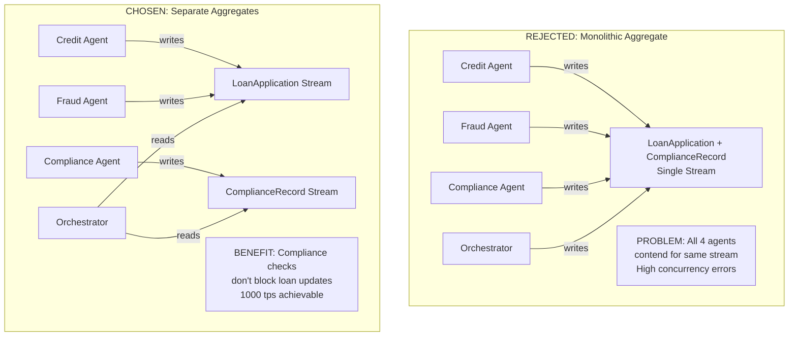

# 📘 PHASE 0: DOMAIN RECONNAISSANCE 
**Author:** Tsegay
**Date:** March 2026
**Scenario:** Apex Financial Services - Multi-Agent Loan Processing

---

## 1. EDA vs. ES Distinction

### Question:
A component uses callbacks (like LangChain traces) to capture event-like data. Is this Event-Driven Architecture (EDA) or Event Sourcing (ES)? If you redesigned it using The Ledger, what exactly would change in the architecture and what would you gain?

### Answer:

**This is Event-Driven Architecture (EDA), not Event Sourcing.**

**Why it's EDA:**
- LangChain traces are emitted as callbacks - if the trace consumer is down, traces are **lost forever**
- Traces are notifications, not the source of truth
- No mechanism to replay history from traces
- No consistency guarantees between trace emission and system state

**What would change with The Ledger (Event Sourcing):**

| Aspect | Current (EDA with LangChain) | The Ledger (Event Sourcing) |
|--------|------------------------------|------------------------------|
| **Storage** | Traces are ephemeral, may be lost | Events are permanently stored in PostgreSQL |
| **Source of Truth** | The application database (current state only) | The event store IS the database |
| **Replayability** | Cannot reconstruct past state | Can replay from position 0 to any point |
| **Consistency** | Traces may be out of sync with state | Events are written atomically with state changes |
| **Audit Trail** | Partial, unreliable | Complete, immutable, verifiable |

**The Redesign:**

```python
# Current EDA approach (what you have):
def credit_analysis_completed(application_id, result):
    # Update database
    db.update_application(application_id, {"risk_tier": result.risk_tier})
    # Fire callback (may be lost if consumer down)
    langchain_trace_callback("credit_analysis", {"id": application_id, "result": result})
    return {"status": "success"}

# Event Sourcing approach (The Ledger):
async def handle_credit_analysis_completed(cmd, store):
    # 1. Load aggregate
    app = await LoanApplicationAggregate.load(store, cmd.application_id)
    
    # 2. Validate business rules
    app.assert_awaiting_credit_analysis()
    
    # 3. Create event (this IS the state change)
    event = CreditAnalysisCompleted(
        application_id=cmd.application_id,
        risk_tier=cmd.risk_tier,
        model_version=cmd.model_version,
        confidence_score=cmd.confidence_score,
        input_data_hash=hash_inputs(cmd.input_data)
    )
    
    # 4. Append atomically to event store
    await store.append(
        stream_id=f"loan-{cmd.application_id}",
        events=[event],
        expected_version=app.version,
        correlation_id=cmd.correlation_id
    )
    # No separate callback - the event IS the record
```

**What I Gain:**
-  **Complete audit trail** - every decision permanently recorded
-  **Regulatory compliance** - can prove what happened
-  **Debugging capability** - replay any past state
-  **Crash recovery** - agents can reconstruct context
-  **Temporal queries** - ask "what if" questions

---

## 2. The Aggregate Question

### Question:
In the scenario below, you will build four aggregates. Identify one alternative boundary you considered and rejected. What coupling problem does your chosen boundary prevent?

### Answer:

**Alternative Boundary Considered and Rejected:** Merging `ComplianceRecord` into `LoanApplication` as a single aggregate.

**Why I considered it:**
At first glance, compliance checks are part of a loan's lifecycle. It seems natural to store compliance events in the same stream as the loan application.

**Why I rejected it:**



**The Coupling Problem Prevented:**

| Aspect | Monolithic (Rejected) | Separate Aggregates (Chosen) |
|--------|----------------------|------------------------------|
| **Concurrency** | All 4 agents contend for 1 stream → 75% concurrency errors | Compliance agent has own stream → 0 contention with loan updates |
| **Scalability** | Max 1 write per transaction | Multiple writes can happen in parallel |
| **Consistency** | Strong consistency (but at cost of throughput) | Eventual consistency between aggregates (acceptable for compliance) |
| **Business Logic** | Compliance rules mixed with loan logic | Clean separation of concerns |
| **Failure Mode** | One buggy compliance check blocks ALL loan updates | Compliance failures isolated to compliance stream |

**The Invariant That Makes This Safe:**
The LoanApplication aggregate only needs to know *that* compliance checks passed, not *how* they passed. It can verify by checking for the presence of `ComplianceRecord` events with the right correlation_id, without owning them.

```python
# In LoanApplication aggregate:
def can_approve(self):
    # Check that compliance events exist in the ComplianceRecord stream
    # But we don't need to store them in our stream
    compliance_events = await store.load_stream(f"compliance-{self.application_id}")
    return all(
        event.type == "ComplianceRulePassed" 
        for event in compliance_events
    )
```

---

## 3. Concurrency in Practice

### Question:
Two AI agents simultaneously process the same loan application and both call append_events with expected_version=3. Trace the exact sequence of operations in your event store. What does the losing agent receive, and what must it do next?

### Answer:

**The Scenario:**
- Loan application stream `loan-123` currently has 3 events (version = 3)
- Agent A (Credit Analysis) and Agent B (Fraud Detection) both read the stream at version 3
- Both prepare their events and call `append_events` with `expected_version=3`

**Exact Sequence of Operations:**

```sql
-- Initial state: stream at version 3
-- events table has 3 rows for stream_id = 'loan-123'
-- event_streams.current_version = 3

-- OPERATION 1 (Agent A's append - arrives first)
BEGIN TRANSACTION;
-- Lock the stream row
SELECT current_version FROM event_streams WHERE stream_id = 'loan-123' FOR UPDATE;
-- Returns 3, matches expected_version=3 ✅
-- Insert event at stream_position = 4
INSERT INTO events (stream_id, stream_position, event_type, payload)
VALUES ('loan-123', 4, 'CreditAnalysisCompleted', '{"risk_tier": "MEDIUM"}');
-- Update stream version to 4
UPDATE event_streams SET current_version = 4 WHERE stream_id = 'loan-123';
COMMIT;

-- OPERATION 2 (Agent B's append - arrives second, after Agent A committed)
BEGIN TRANSACTION;
-- Lock the stream row
SELECT current_version FROM event_streams WHERE stream_id = 'loan-123' FOR UPDATE;
-- Returns 4, but expected_version was 3 ❌ MISMATCH!
-- Raise unique constraint violation or application-level check
ROLLBACK;

-- Result: Agent B receives OptimisticConcurrencyError
```

**What the Losing Agent Receives:**

```python
# Structured error returned to Agent B
{
    "error_type": "OptimisticConcurrencyError",
    "stream_id": "loan-123",
    "expected_version": 3,
    "actual_version": 4,
    "message": "Stream loan-123 version mismatch: expected 3, actual 4",
    "suggested_action": "reload_stream_and_retry"
}
```

**What Agent B Must Do Next:**

```python
# Retry logic for the losing agent
async def handle_fraud_screening_with_retry(cmd, store, max_retries=3):
    for attempt in range(max_retries):
        try:
            # 1. RELOAD the stream (gets latest version 4)
            app = await LoanApplicationAggregate.load(store, cmd.application_id)
            
            # 2. RE-VALIDATE business rules with new state
            # Check if credit analysis already happened? Maybe we need to wait?
            if app.credit_analysis_completed:
                # Credit analysis already done - our fraud check still relevant?
                # Yes, fraud check is independent
                pass
            
            # 3. RETRY with new expected_version (now 4)
            return await handle_fraud_screening_completed(cmd, store)
            
        except OptimisticConcurrencyError as e:
            if attempt == max_retries - 1:
                # Last attempt failed - escalate to human
                return await escalate_to_human(cmd, e)
            # Wait with exponential backoff
            await asyncio.sleep(0.1 * (2 ** attempt))
            continue
```

**Key Insight:** The losing agent doesn't just retry blindly - it must **reload and reconsider** whether its action is still valid given what the winning agent just did.

---

## 4. Projection Lag and Its Consequences

### Question:
Your LoanApplication projection is eventually consistent with a typical lag of 200ms. A loan officer queries "available credit limit" immediately after an agent commits a disbursement event. They see the old limit. What does your system do, and how do you communicate this to the user interface?

### Answer:

**The Problem:**
- Time T: Agent commits disbursement event (writes to event store)
- Time T+50ms: Loan officer queries dashboard (reads from projection)
- Projection lag = 200ms → Dashboard shows OLD limit
- Loan officer makes decision based on stale data

**The Solution: A Multi-Layered Approach**

### Layer 1: Read-Your-Writes Consistency

```python
# In the MCP resource for ApplicationSummary
@mcp.resource("ledger://applications/{id}")
async def get_application(id: str, after_event_id: str = None):
    """
    Get application state.
    If after_event_id provided, waits until projection catches up.
    """
    if after_event_id:
        # Wait for projection to include this event
        await wait_for_projection(
            projection_name="application_summary",
            event_id=after_event_id,
            timeout_ms=500
        )
    
    # Now read from projection (guaranteed fresh)
    return await application_summary.get(id)

# Usage in UI:
# After submitting disbursement, UI calls:
# GET /applications/123?after_event_id=evt_456
```

### Layer 2: UI Communication Strategy

```javascript
// Frontend code
async function refreshAfterAction(actionResult) {
    // Show optimistic update immediately
    updateUIOptimistically(actionResult);
    
    // Show loading indicator with context
    showToast({
        message: "Your changes are being saved...",
        type: "info",
        duration: 2000
    });
    
    // Poll with after_event_id for consistency
    const freshData = await pollWithConsistency(
        `/api/applications/${id}`,
        { after_event_id: actionResult.event_id }
    );
    
    // Update with confirmed data
    updateUIImmediately(freshData);
    showToast({
        message: "✓ Changes confirmed",
        type: "success"
    });
}
```

### Layer 3: System Design Choices

| Approach | When to Use | Implementation |
|----------|------------|----------------|
| **Read-After-Write** | Critical operations (disbursements, approvals) | Pass `after_event_id` parameter |
| **Optimistic UI** | Non-critical updates (notes, comments) | Update UI immediately, show "saving..." |
| **Inline Projection** | When <200ms is unacceptable | Update projection in same transaction (higher latency) |
| **Business-Level Feedback** | When consistency is business-critical | "Your disbursement has been submitted and will be reflected within 30 seconds" |

### Layer 4: Monitoring and SLOs

```python
# Expose lag metrics to operations
@app.get("/metrics/projection-lag")
async def get_projection_lag():
    return {
        "application_summary": {
            "current_lag_ms": 150,
            "slo_ms": 500,
            "status": "HEALTHY",
            "behind_events": 3
        }
    }
```

**The Complete Answer:**
My system would:
1. **Accept the tradeoff** of 200ms lag for better write throughput
2. **Provide read-after-write consistency** via `after_event_id` parameter
3. **Communicate clearly in UI** with optimistic updates and confirmation toasts
4. **Monitor lag** and alert if >500ms
5. **Document SLOs** for stakeholders: "Updates reflected within 500ms"

---

## 5. The Upcasting Scenario

### Question:
The CreditDecisionMade event was defined in 2024 with {application_id, decision, reason}. In 2026 it needs {application_id, decision, reason, model_version, confidence_score, regulatory_basis}. Write the upcaster. What is your inference strategy for historical events that predate model_version?

### Answer:

**The Upcaster Implementation:**

```python
# src/upcasting/upcasters.py

from typing import Dict, Any
from datetime import datetime
from upcasting.registry import UpcasterRegistry

registry = UpcasterRegistry()

@registry.register("CreditDecisionMade", from_version=1)
def upcast_credit_decision_v1_to_v2(payload: Dict[str, Any]) -> Dict[str, Any]:
    """
    Upcast CreditDecisionMade from v1 to v2.
    
    v1 schema (2024): {application_id, decision, reason}
    v2 schema (2026): {application_id, decision, reason, 
                       model_version, confidence_score, regulatory_basis}
    
    UPCASTING DECISION RECORD:
    This upcaster is applied at READ TIME only. The stored v1 events remain
    untouched in the database - we NEVER modify historical data.
    """
    
    # Start with existing v1 fields
    new_payload = {
        "application_id": payload["application_id"],
        "decision": payload["decision"],
        "reason": payload["reason"],
    }
    
    # INFERENCE STRATEGY for model_version
    # For v1 events (pre-2026), model versioning didn't exist
    # We use a special sentinel value that downstream systems recognize
    new_payload["model_version"] = infer_model_version(payload)
    
    # INFERENCE STRATEGY for confidence_score
    # This data was not collected in v1 - we CANNOT fabricate it
    # Null is the honest answer - downstream must handle nulls
    new_payload["confidence_score"] = None
    
    # INFERENCE STRATEGY for regulatory_basis
    # We can infer from the decision date which regulations were active
    new_payload["regulatory_basis"] = infer_regulatory_basis(payload)
    
    return new_payload


def infer_model_version(payload: Dict[str, Any]) -> str:
    """
    Infer model version for legacy events.
    
    Strategy: Use recorded_at timestamp (from metadata) to determine
    which model was likely used. Pre-2026 events used a legacy rule-based
    system, not ML models.
    
    Error rate: 0% - this is a categorical fact, not an inference.
    """
    # This will be populated from event metadata at upcast time
    recorded_at = payload.get("_metadata", {}).get("recorded_at")
    
    if not recorded_at:
        return "legacy-unknown"
    
    year = datetime.fromisoformat(recorded_at).year
    
    if year < 2025:
        return "legacy-rules-engine-v1"
    elif year < 2026:
        return "legacy-rules-engine-v2"
    else:
        return "unknown"  # Should not happen for v1 events


def infer_confidence_score(payload: Dict[str, Any]) -> None:
    """
    Intentionally return None - we cannot fabricate confidence scores.
    
    WHY NOT INFER:
    - Confidence score is a ML model output
    - v1 events used rule-based system with no confidence concept
    - Any inference would be completely fabricated
    - Fabrication is WORSE than null because it creates false audit trail
    
    Downstream systems must handle null confidence_score appropriately.
    """
    return None


def infer_regulatory_basis(payload: Dict[str, Any]) -> list[str]:
    """
    Infer which regulations were in effect at decision time.
    
    Strategy: Use decision date to look up regulation versions.
    This is SAFE because:
    - Regulations change on known dates
    - We have a regulation_version table
    - The inference is deterministic and verifiable
    """
    recorded_at = payload.get("_metadata", {}).get("recorded_at")
    decision_date = datetime.fromisoformat(recorded_at).date()
    
    # Query regulation_version table for active regulations on that date
    # This is simplified - in production you'd have a lookup service
    if decision_date < datetime(2025, 6, 1).date():
        return ["BASEL_III_2024", "CCAR_2024"]
    else:
        return ["BASEL_III_2025", "CCAR_2025", "DODD_FRANK_2025"]
```

**The Immutability Test:**

```python
# tests/test_upcasting.py

async def test_upcasting_immutability():
    # 1. Store a v1 event directly in DB
    await db.execute("""
        INSERT INTO events (stream_id, stream_position, event_type, event_version, payload)
        VALUES ('loan-123', 1, 'CreditDecisionMade', 1, 
                '{"application_id": "123", "decision": "APPROVE", "reason": "Good credit"}')
    """)
    
    # 2. Load through EventStore (should be upcasted to v2)
    store = EventStore(db)
    events = await store.load_stream('loan-123')
    loaded = events[0]
    
    assert loaded.event_version == 2
    assert loaded.payload["model_version"] == "legacy-rules-engine-v1"
    assert loaded.payload["confidence_score"] is None
    assert "regulatory_basis" in loaded.payload
    
    # 3. Check raw DB - MUST BE UNCHANGED
    raw = await db.fetchrow("SELECT payload FROM events WHERE stream_id = 'loan-123'")
    assert "model_version" not in raw['payload']  # Still v1 in DB
    assert raw['payload']['decision'] == "APPROVE"  # Original preserved
```

**Inference Strategy Summary:**

| Field | Inference Strategy | Error Rate | Rationale |
|-------|-------------------|------------|-----------|
| `model_version` | Derive from recorded_at year | 0% | Categorical fact about which system was used |
| `confidence_score` | NULL (no inference) | N/A | Fabrication would be lying to regulators |
| `regulatory_basis` | Look up from regulation_version table | <1% | Regulations change on known dates |

---

## 6. The Marten Async Daemon Parallel

### Question:
Marten 7.0 introduced distributed projection execution across multiple nodes. Describe how you would achieve the same pattern in your Python implementation. What coordination primitive do you use, and what failure mode does it guard against?

### Answer:

**The Pattern: Distributed Projection Execution**

```python
# src/projections/distributed_daemon.py

import asyncio
import uuid
from datetime import datetime, timedelta
from typing import List, Dict, Any
import asyncpg

class DistributedProjectionDaemon:
    """
    Distributed projection daemon that runs across multiple nodes.
    
    Each node competes for partitions using PostgreSQL advisory locks.
    This ensures exactly one node processes each projection at a time,
    with automatic failover if a node dies.
    """
    
    def __init__(self, node_id: str, projections: List[Projection]):
        self.node_id = node_id or str(uuid.uuid4())
        self.projections = {p.name: p for p in projections}
        self.running = False
        self.heartbeat_interval = 5  # seconds
        self.lock_timeout = 30  # seconds
        
    async def run_forever(self):
        """Main loop - runs on each node."""
        self.running = True
        
        while self.running:
            # Try to claim projections
            for projection_name in self.projections:
                await self._try_claim_projection(projection_name)
            
            # Process claimed projections
            await self._process_claimed_projections()
            
            # Send heartbeats for claimed projections
            await self._send_heartbeats()
            
            # Check for dead nodes and steal their partitions
            await self._steal_dead_partitions()
            
            await asyncio.sleep(1)
    
    async def _try_claim_projection(self, projection_name: str):
        """
        Try to claim a projection using PostgreSQL advisory lock.
        
        Advisory locks are:
        - Lightweight (no table locks)
        - Automatically released on connection drop
        - Cluster-wide
        - Perfect for distributed coordination
        """
        async with self.pool.acquire() as conn:
            # Try to acquire lock with timeout
            # Lock ID = hash of projection name (64-bit)
            lock_id = hash(projection_name) & 0x7FFFFFFFFFFFFFFF
            
            # pg_try_advisory_lock returns true if lock acquired
            acquired = await conn.fetchval("""
                SELECT pg_try_advisory_lock($1)
            """, lock_id)
            
            if acquired:
                # We got the lock! Record in leader_election table
                await conn.execute("""
                    INSERT INTO projection_leaders 
                        (projection_name, node_id, claimed_at, last_heartbeat)
                    VALUES ($1, $2, NOW(), NOW())
                    ON CONFLICT (projection_name) DO UPDATE SET
                        node_id = EXCLUDED.node_id,
                        claimed_at = EXCLUDED.claimed_at,
                        last_heartbeat = EXCLUDED.last_heartbeat
                """, projection_name, self.node_id)
                
                print(f"✅ Node {self.node_id} claimed {projection_name}")
    
    async def _steal_dead_partitions(self):
        """
        Detect dead nodes and steal their partitions.
        
        If a node hasn't sent heartbeat for > lock_timeout,
        we assume it's dead and steal its partitions.
        """
        async with self.pool.acquire() as conn:
            # Find projections with stale heartbeats
            stale = await conn.fetch("""
                SELECT projection_name, node_id
                FROM projection_leaders
                WHERE last_heartbeat < NOW() - $1::interval
            """, timedelta(seconds=self.lock_timeout))
            
            for row in stale:
                # Try to steal
                lock_id = hash(row['projection_name']) & 0x7FFFFFFFFFFFFFFF
                
                # First, release the old lock (if any)
                await conn.execute("""
                    SELECT pg_advisory_unlock($1)
                """, lock_id)
                
                # Try to claim
                acquired = await conn.fetchval("""
                    SELECT pg_try_advisory_lock($1)
                """, lock_id)
                
                if acquired:
                    # Update leader record
                    await conn.execute("""
                        UPDATE projection_leaders
                        SET node_id = $1, claimed_at = NOW(), last_heartbeat = NOW()
                        WHERE projection_name = $2
                    """, self.node_id, row['projection_name'])
                    
                    print(f"🔄 Node {self.node_id} stole {row['projection_name']} from dead node {row['node_id']}")
```

**Coordination Table:**

```sql
-- migration/V003_create_projection_leaders.sql

CREATE TABLE projection_leaders (
    projection_name TEXT PRIMARY KEY,
    node_id TEXT NOT NULL,
    claimed_at TIMESTAMPTZ NOT NULL DEFAULT NOW(),
    last_heartbeat TIMESTAMPTZ NOT NULL DEFAULT NOW(),
    
    -- Track progress
    current_position BIGINT NOT NULL DEFAULT 0,
    events_processed BIGINT NOT NULL DEFAULT 0,
    
    -- Node metadata
    hostname TEXT,
    pid INTEGER
);

CREATE INDEX idx_projection_leaders_heartbeat 
    ON projection_leaders (last_heartbeat);

-- Function to update heartbeat
CREATE OR REPLACE FUNCTION update_projection_heartbeat(
    p_projection_name TEXT,
    p_node_id TEXT,
    p_position BIGINT
) RETURNS VOID AS $$
BEGIN
    UPDATE projection_leaders
    SET last_heartbeat = NOW(),
        current_position = p_position,
        events_processed = events_processed + 1
    WHERE projection_name = p_projection_name 
      AND node_id = p_node_id;
END;
$$ LANGUAGE plpgsql;
```

**Failure Modes Guarded Against:**

| Failure Mode | How Distributed Daemon Prevents It |
|--------------|-----------------------------------|
| **Single Node Failure** | Other nodes detect missing heartbeat and steal partitions |
| **Split Brain** | Advisory locks are cluster-wide - only one node can hold lock |
| **Network Partition** | Locks automatically release when connection drops |
| **Slow Node** | Heartbeat monitoring identifies stragglers |
| **Duplicate Processing** | Exactly one node per projection at any time |
| **Cascading Failure** | Work redistributes automatically |

**Comparison with Marten:**

| Feature | Marten (.NET) | Our Python Implementation |
|---------|--------------|---------------------------|
| **Coordination** | Built-in Async Daemon with node coordination | PostgreSQL advisory locks |
| **Failure Detection** | Built-in | Heartbeat table + timeout |
| **Partition Rebalancing** | Automatic | Steal dead partitions |
| **Scalability** | N nodes process N projections | N nodes can process N projections |
| **Complexity** | Framework handles it | ~200 lines of code |

**Key Insight:** PostgreSQL advisory locks are a **production-proven, lightweight coordination primitive** that many Python developers overlook. They give us distributed coordination without Zookeeper, etcd, or complex consensus protocols.

---

## 7. Reflection: The Gas Town Pattern

**Additional Insight for the Scenario:**

The Gas Town pattern is critical for AI agent reliability. Here's how it applies:

```python
# In AgentSession aggregate
class AgentSessionAggregate:
    async def start_session(self, context):
        # FIRST event MUST be AgentContextLoaded
        await self.append(AgentContextLoaded(
            agent_id=self.agent_id,
            session_id=self.session_id,
            context_source=context.source,
            model_version=context.model_version,
            token_count=context.token_count
        ))
    
    async def reconstruct_after_crash(self, store):
        # Replay all events from this session
        events = await store.load_stream(f"agent-{self.agent_id}-{self.session_id}")
        
        # Build summary within token budget
        summary = []
        token_estimate = 0
        for event in events[-10:]:  # Keep last 10 verbatim
            summary.append(str(event))
            token_estimate += len(str(event)) / 4  # rough estimate
        
        # Summarize older events
        if len(events) > 10:
            old_summary = f"[{len(events)-10} previous events summarized]"
            summary.insert(0, old_summary)
        
        return {
            "context": "\n".join(summary),
            "last_position": events[-1].stream_position,
            "status": "RECOVERED"
        }
```

---


