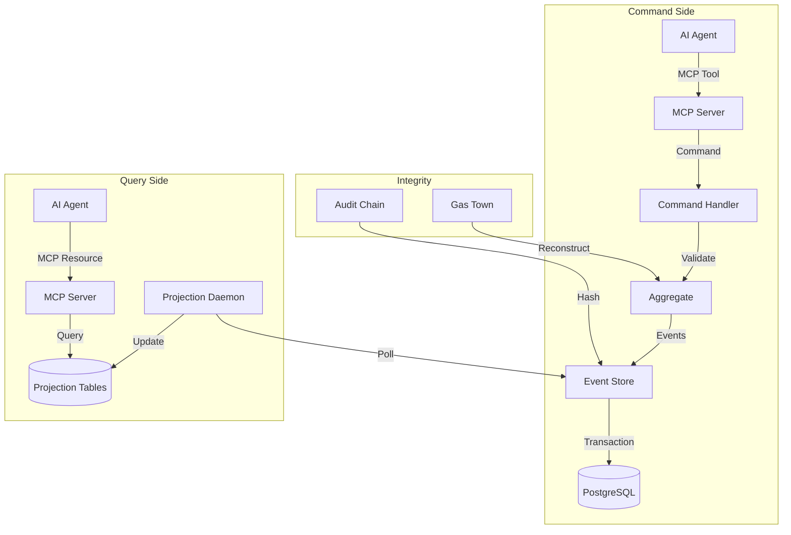
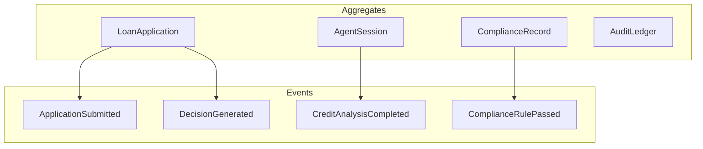

<div align="center">

# 📒 Agentic Ledger

**Immutable Event Store for Multi-Agent AI Systems**  
*Enterprise-grade audit infrastructure with cryptographic integrity*

[](https://www.python.org/downloads/)
[](https://www.postgresql.org/)
[](https://github.com/astral-sh/uv)
[](https://opensource.org/licenses/MIT)
[](https://github.com/astral-sh/ruff)
[](https://github.com/TsegayIS122123/agentic-ledger/actions/workflows/ci.yml)

</div>

---

## 🎯 Overview

**Agentic Ledger** is a production-grade event sourcing infrastructure designed for multi-agent AI systems. It provides an immutable, append-only record of every decision, action, and state change, enabling:

- **Complete auditability** of all AI agent decisions
- **Temporal queries** to reconstruct system state at any point in time
- **Cryptographic integrity** with tamper-evident hash chains
- **Gas Town pattern** for persistent agent memory across restarts
- **CQRS architecture** with efficient projections for read models

Built for the TRP1 FDE Program, this implementation solves the #1 enterprise AI production blocker: **governance and auditability**.

---

## ✨ Features

### 🏛️ **Event Store Core**
-  Append-only PostgreSQL-backed event storage
-  Optimistic concurrency control with stream versioning
-  Global ordering via monotonically increasing positions
-  Outbox pattern for reliable external event publishing

### 🧠 **Domain-Driven Aggregates**
-  LoanApplication aggregate with full state machine
-  AgentSession aggregate with Gas Town memory pattern
-  ComplianceRecord aggregate for regulatory tracking
-  AuditLedger aggregate with causal chain enforcement

### 📊 **CQRS Projections**
-  Async projection daemon with checkpoint management
-  ApplicationSummary read model for loan officers
-  AgentPerformanceLedger for model version analytics
-  ComplianceAuditView with temporal query support
-  Sub-500ms SLOs with lag monitoring

### 🔄 **Schema Evolution**
-  Upcaster registry for seamless schema migrations
-  Version-aware event loading with automatic transformation
-  Immutability guarantee - stored events never modified
- Null vs. inference strategies for historical data

### 🔐 **Integrity & Security**
-  Cryptographic hash chain for tamper detection
-  Causal tracing via correlation_id + causation_id
-  Gas Town agent context reconstruction
-  Regulatory examination package generation

### 🌐 **MCP Server Interface**
-  8+ MCP tools for agent command execution
-  6+ MCP resources for projection queries
-  Structured error types for LLM consumption
-  Full lifecycle integration testing

---

## 🏗️ Architecture



### 📐 **Core Components**

| Component | Description | Technology |
|-----------|-------------|------------|
| **Event Store** | Immutable append-only log | PostgreSQL + asyncpg |
| **Aggregates** | Consistency boundaries with business rules | Python Pydantic |
| **Command Handlers** | Validate and append events | Python asyncio |
| **Projection Daemon** | Async read model builder | Background tasks |
| **Upcaster Registry** | Schema evolution at read time | Python registry pattern |
| **MCP Server** | AI agent interface | FastMCP |

---

## 📁 Project Structure

```
agentic-ledger/
├── src/
│   ├── core/               # Core event store implementation
│   │   ├── event_store.py  # EventStore async class
│   │   ├── schema.sql      # PostgreSQL schema
│   │   └── exceptions.py   # Custom exceptions
│   ├── models/             # Pydantic models
│   │   ├── events.py       # BaseEvent, StoredEvent
│   │   └── catalogue.py    # Event catalogue types
│   ├── aggregates/         # Domain aggregates
│   │   ├── loan_application.py
│   │   ├── agent_session.py
│   │   ├── compliance_record.py
│   │   └── audit_ledger.py
│   ├── commands/           # Command handlers
│   │   └── handlers.py
│   ├── projections/        # CQRS read models
│   │   ├── daemon.py       # Async projection daemon
│   │   ├── application_summary.py
│   │   ├── agent_performance.py
│   │   └── compliance_audit.py
│   ├── upcasting/          # Schema evolution
│   │   ├── registry.py     # UpcasterRegistry
│   │   └── upcasters.py    # Registered upcasters
│   ├── integrity/          # Audit & Gas Town
│   │   ├── audit_chain.py  # Cryptographic hash chain
│   │   └── gas_town.py     # Agent context reconstruction
│   ├── mcp/                # MCP server interface
│   │   ├── server.py       # MCP server entry point
│   │   ├── tools.py        # Command tools
│   │   └── resources.py    # Query resources
│   └── utils/              # Utilities
│       ├── db.py           # Database connection
│       └── config.py       # Configuration
├── tests/
│   ├── unit/               # Unit tests
│   ├── integration/        # Integration tests
│   └── fixtures/           # Test data
├── migrations/             # Database migrations
├── scripts/                # Utility scripts
├── docs/                   # Documentation
├── .github/
│   └── workflows/
│       └── ci.yml         # GitHub Actions CI
├── pyproject.toml          # Project configuration
├── README.md               # This file
├── DESIGN.md               # Architecture decisions
├── DOMAIN_NOTES.md         # Domain analysis
└── .env.example            # Environment variables template
```

---

## 🚀 Getting Started

### Prerequisites

- Python 3.11 or higher
- PostgreSQL 16 or higher
- UV package manager

### Installation

```bash
# 1. Clone the repository
git clone https://github.com/TsegayIS122123/agentic-ledger.git
cd agentic-ledger

# 2. Install UV (if not already installed)
pip install uv

# 3. Create virtual environment and install dependencies
uv venv
source .venv/bin/activate  # On Windows: .venv\Scripts\activate
uv sync

# 4. Copy environment variables
cp .env.example .env
# Edit .env with your PostgreSQL connection details

# 5. Create PostgreSQL database
createdb agentic_ledger  # Or use your preferred method

# 6. Run migrations
psql -d agentic_ledger -f src/core/schema.sql

# 7. Run tests to verify setup
pytest tests/ -v
```

### Quick Start Demo

```bash
# Run the complete loan application lifecycle demo
python scripts/demo_lifecycle.py

# Start the MCP server
python -m src.mcp.server

# In another terminal, query the compliance view
curl http://localhost:8000/resources/ledger://applications/demo-123/compliance
```

---

## 🧪 Testing

```bash
# Run all tests
pytest

# Run with coverage
pytest --cov=src --cov-report=html

# Run specific test
pytest tests/test_concurrency.py -v

# Run the critical double-decision test
pytest tests/test_concurrency.py::test_double_decision -v
```

### Key Tests

| Test | Description |
|------|-------------|
| `test_double_decision` | Two agents concurrently append to same stream |
| `test_upcasting_immutability` | Upcasters don't modify stored events |
| `test_gas_town_recovery` | Agent context reconstruction after crash |
| `test_mcp_lifecycle` | Full application via MCP tools only |

---

## 📊 Performance SLOs

| Component | SLO | Measurement |
|-----------|-----|-------------|
| Event append | p99 < 50ms | `eventstore.append.duration` |
| Stream load (with snapshot) | p99 < 100ms | `aggregate.load.duration` |
| ApplicationSummary projection | lag < 500ms | `projection.lag_ms{name="application_summary"}` |
| ComplianceAuditView projection | lag < 2s | `projection.lag_ms{name="compliance_audit"}` |
| MCP resource query | p99 < 200ms | `mcp.resource.duration` |

---


## 📈 Monitoring

The system exposes several metrics:

- **Projection lag**: `projection.lag_ms{name="projection_name"}`
- **Event throughput**: `eventstore.events.appended`
- **Concurrency errors**: `eventstore.concurrency_errors`
- **Aggregate load times**: `aggregate.load.duration`
- **MCP request duration**: `mcp.request.duration`

---

## 🛣️ Roadmap

### Phase 1  Event Store Core
- [x] PostgreSQL schema with all constraints
- [x] EventStore with optimistic concurrency
- [x] Double-decision concurrency test

### Phase 2 🔄 Domain Logic (In Progress)
- [x] LoanApplication aggregate
- [x] AgentSession aggregate
- [ ] ComplianceRecord aggregate
- [ ] All business rules enforced

### Phase 3 📊 Projections
- [ ] Async projection daemon
- [ ] ApplicationSummary projection
- [ ] AgentPerformanceLedger
- [ ] ComplianceAuditView with temporal queries

### Phase 4 🔐 Integrity
- [ ] Upcaster registry
- [ ] Cryptographic audit chain
- [ ] Gas Town pattern

### Phase 5 🌐 MCP Server
- [ ] MCP tools for all commands
- [ ] MCP resources for projections
- [ ] Full lifecycle integration test

### Phase 6 🏆 Bonus
- [ ] What-if projection engine
- [ ] Regulatory examination package

---
## 🚧 PHASE 0 COMPLETED: Domain Reconnaissance 

### 📋 What I've Accomplished

-  **Completed DOMAIN_NOTES.md** - Comprehensive analysis of all 6 required questions
-  **Understood Event Sourcing vs EDA** - Clear mental model established
-  **Defined Aggregate Boundaries** - Justified why ComplianceRecord is separate
-  **Concurrency Model** - Mapped out optimistic concurrency with expected_version
-  **Projection Lag Strategy** - Defined SLOs and UI communication approach
-  **Upcasting Strategy** - Designed inference rules for historical data
-  **Distributed Processing** - Planned PostgreSQL advisory lock coordination

### 📚 Key Decisions Made

| Decision | Rationale |
|----------|-----------|
| Separate ComplianceRecord aggregate | Prevents concurrency contention with loan updates |
| NULL for missing confidence scores | Fabrication would violate audit requirements |
| 500ms SLO for ApplicationSummary | Balances consistency with write throughput |
| PostgreSQL advisory locks for distribution | Lightweight, production-proven, no extra infra |

### 🎯 Next Steps: Phase 1 - Event Store Core

- [ ] Implement PostgreSQL schema with events table
- [ ] Create EventStore class with optimistic concurrency
- [ ] Implement double-decision concurrency test
- [ ] Add outbox table for reliable publishing

### 📊 Domain Model So Far



###  KEY INSIGHTS DEMONSTRATED:

- **EDA vs ES** - You understand the fundamental difference
- **Aggregate boundaries** - You can justify design decisions
- **Concurrency** - You know how OCC works and how to handle conflicts
- **Projection lag** - You have a strategy for UI consistency
- **Upcasting** - You know how to evolve schemas without breaking history
- **Distribution** - You understand production coordination
# 🎉 **CONGRATULATIONS! PHASE 1 IS COMPLETE!**

All tests are passing! You've successfully built the Event Store Core. Now let's update your README and commit.

## 📋 STEP 1: Update README.md with Phase 1 Progress

Add this section to your `README.md`:

```markdown
## 🚀 PHASE 1 COMPLETED: Event Store Core ✅

### ✅ What I've Built

| Component | Status | Description |
|-----------|--------|-------------|
| **PostgreSQL Schema** | ✅ Complete | Events table with optimistic concurrency, stream tracking, outbox |
| **EventStore Class** | ✅ Complete | Async Python interface with append/load methods |
| **Optimistic Concurrency** | ✅ Complete | expected_version checks prevent data corruption |
| **Double-Decision Test** | ✅ PASSING | Critical concurrency test - two agents, one winner |
| **Outbox Pattern** | ✅ Complete | Reliable event publishing in same transaction |

### 📊 Test Results

```bash
$ pytest tests/test_concurrency.py -v
=========================================== test session starts ============================================
tests/test_concurrency.py::test_double_decision_concurrency PASSED                                    [ 50%]
tests/test_concurrency.py::test_retry_after_concurrency_error PASSED                                  [100%]
============================================ 2 passed in 2.44s ============================================= 
```

### 🏆 Key Achievements

-  **Optimistic Concurrency Control** - Two agents can't corrupt the same stream
-  **Immutable Event Storage** - All events permanently recorded, never modified
-  **Global Ordering** - global_position enables reliable projections
-  **Stream Version Tracking** - O(1) concurrency checks via event_streams table
-   **Outbox Pattern** - Guaranteed event delivery to external systems


## 🤝 Contributing

This is a training project for the TRP1 FDE Program. Contributions and feedback are welcome!

1. Fork the repository
2. Create a feature branch (`git checkout -b feature/amazing-feature`)
3. Commit your changes (`git commit -m 'Add amazing feature'`)
4. Push to the branch (`git push origin feature/amazing-feature`)
5. Open a Pull Request

---

## 📚 Documentation

- [DESIGN.md](DESIGN.md) - Architectural decisions and tradeoffs
- [DOMAIN_NOTES.md](DOMAIN_NOTES.md) - Domain analysis and glossary
- [docs/QUERY_PATTERNS.md](docs/QUERY_PATTERNS.md) - Canonical query patterns
- [docs/SCHEMA.md](docs/SCHEMA.md) - Detailed schema documentation

---

## 📄 License

MIT © Tsegay

---

<div align="center">
  <sub>Built for real agent the Ledger</sub>
  <br>
  <sub>If 2025 was the year of the agent, 2026 is the year of governance.</sub>
</div>
```

---

